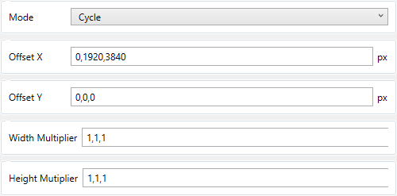

# Monitor Toggle Plugin for [OpenTabletDriver](https://github.com/OpenTabletDriver/OpenTabletDriver) 

Bindings for switching between monitors.

## Quick Start Guide

- Enable the `Monitor Toggle` filter

- Click the `...` next to a binding and select `Monitor Toggle`

- Configure the settings for your binding

## Binding Settings

**Mode:** The monitor switching mode to use. Toggle, Hold, or Cycle.

Toggle activates when the binding is pressed and deactivates when the binding is pressed a second time.

Hold activates when the binding is pressed and deactivates when the binding is released.

Cycle activates when the binding is pressed and always stays active. When the binding is pressed again it changes to the next setting. Specify multiple settings for cycle mode by separating them with a comma. See [Cycle Mode](#cycle-mode) for setup instructions.

**Offset X:** The amount in pixels to offset the cursor's X position by.

**Offset Y:** The amount in pixels to offset the cursor's Y position by.

**Width Multiplier:** In absolute mode, the multiplier to increase the monitor area's width by. In relative mode, the multiplier to increase the X sensitivity by.

**Height Mutiplier:** In absolute mode, the multiplier to increase the monitor area's height by. In relative mode, the multiplier to increase the Y sensitivity by.

## Cycle Mode

Cycle mode should be used with multiple sets of settings for each value. The values for each part of the cycle should be separated by a comma `,`.

For example, the following settings will cycle between (0,0) offset and (1,1) multiplier, (1920, 0) offset and (1,1) multiplier, (3840, 0) offset and (1,1) multiplier. It will then loop back to to (0,0) offset and (1,1) multiplier.

All values must be filled for each part of the cycle. Note that even though Offset Y, Width Multiplier, and Height Multiplier do not change, they are still included three times.

